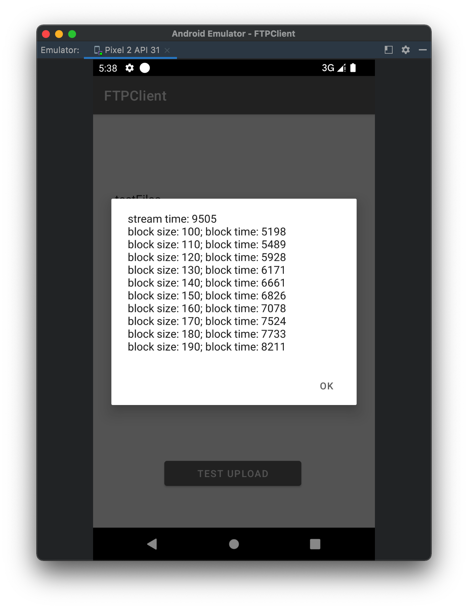

# 计算机网络 Project

## FTP 协议实现

使用 TCP 连接创建控制连接，控制连接采用 Telnet 协议，即在 TCP IO 流中传输命令和回复。

数据连接在需要发起 `STOR` 或 `RETR` 时才会建立，client 根据用户选择的连接模式，选择 `PORT` 或 `PASV` 指令建立数据连接。`PORT` 连接由 client 监听一个端口并把 IP 地址由 `PORT` 指令的参数传送给 server；`PASV` 要求 server 监听一个端口并由响应信息传回给 client。

Stream 传输模式下，每个文件的传输建立一次连接，根据连接断开判断文件结尾，因为 TCP 是可靠数据连接，这种做法能保证文件正确传输。因此，我们的实现中 Ascii Type 和 Binary Type 没有区别，因为 Ascii 文件中的 `EOF`（即 Byte 类型的 `-1`）不是传输判断文件结尾的标志。

## 传输优化策略

我们把 Block 传输模式实现为一个持续连接的传输模式，多个文件传输共享一次数据连接，这种策略在大量小文件的传输中可以节省创建 TCP 连接的时间。重用数据连接的关键是能够分割同一数据流中的两个文件，我们的具体实现如下：

每个文件传输前，发送方会先发送一个头部，指示这次传输的 block size：
```c
struct BlockHdr{
	uint64 blk_sz;
}
```

接收方读取一个 `sizeof(struct BlockHdr)` 的数据并准备接收文件。发送方把文件流分成若干个 Block 传输，每个 Block 的格式为：
```c
struct Block{
	char data[blk_sz];
	uint64 len;
	uint64 checksum;
	bool eof;
}
```

其中 `len` 为该 block 中有效数据的长度，除了最后一个 block ，都应为 `blk_sz`；`checksum` 为 `data` 部分的校验和；`eof` 指示是否为该文件最后一个块。

在传输上我们的策略会产生 `sizeof(BlockHdr) + n * (sizeof(uint64) + sizeof(uint64) + sizeof(bool))` 的冗余，其中 `n = FileSize/BlockSize` 为 block 数。

一种容易想到的节约传输冗余的策略是，在 `BlockHdr` 中发送文件长度，然后接收方从数据流中读取指定长度的字节作为一个文件。但是这种策略首先要知道文件长度，对于流式产生的文件，发送方首先要缓存整个文件，统计字节数后才能开始发送整个文件。在这种不能提前预知文件长度的场景下，我们的传输策略仍然有效，且需要发送方的缓存大小仅为 `blk_sz`。

在我们的实验中，我们模拟发送 50 个小文件的场景，设定不同 BlockSize，对比 Block 模式与 Stream 模式的传输时间



在效果最好的 BlockSize 下，Block 模式相比 Stream 模式缩减了约 `100ms/File` ，这与一次 TCP 连接建立所需时间应该比较相近。
