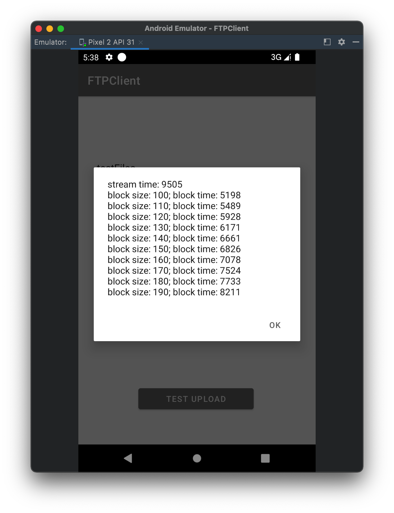

# 计算机网络Proj1

刘乔升 19300200019 / 佘家瑞 19302010035

## FTP协议实现

使用TCP连接创建控制连接，控制连接采用Telnet协议，即在TCP IO流中传输命令和回复。

数据连接在需要发起STOR或RETR时才会建立，client根据用户选择的连接模式，选择PORT或PASV指令建立数据连接。PORT连接由client监听一个端口并把IP地址由PORT指令的参数传送给server；PASV要求server监听一个端口并由响应信息传回给client。

Stream传输模式下，每个文件的传输建立一次连接，根据连接断开判断文件结尾，因为TCP是可靠数据连接，这种做法能保证文件正确传输。因此，我们的实现中Ascii Type和Binary Type没有区别，因为Ascii文件中的EOF（即Byte类型的-1）不是传输判断文件结尾的标志。

## 传输优化策略

我们把Block传输模式实现为一个持续连接的传输模式，多个文件传输共享一次数据连接，这种策略在大量小文件的传输中可以节省创建TCP连接的时间。重用数据连接的关键是能够分割同一数据流中的两个文件，我们的具体实现如下：

每个文件传输前，发送方会先发送一个头部，指示这次传输的block size：
```c
struct BlockHdr{
	uint64 blk_sz;
}
```

接收方读取一个`sizeof(struct BlockHdr)`的数据并准备接收文件。发送方把文件流分成若干个Block传输，每个Block的格式为：
```c
struct Block{
	char data[blk_sz];
	uint64 len;
	uint64 checksum;
	bool eof;
}
```

其中`len`为该block中有效数据的长度，除了最后一个block，都应为`blk_sz`；`checksum`为`data`部分的校验和；`eof`指示是否为该文件最后一个块。

在传输上我们的策略会产生 `sizeof(BlockHdr) + n * (sizeof(uint64) + sizeof(uint64) + sizeof(bool))` 的冗余，其中 `n = FileSize/BlockSize` 为block数。

一种容易想到的节约传输冗余的策略是，在`BlockHdr`中发送文件长度，然后接收方从数据流中读取指定长度的字节作为一个文件。但是这种策略首先要知道文件长度，对于流式产生的文件，发送方首先要缓存整个文件，统计字节数后才能开始发送整个文件。在这种不能提前预知文件长度的场景下，我们的传输策略仍然有效，且需要发送方的缓存大小仅为`blk_sz`。

在我们的实验中，我们模拟发送50个小文件的场景，设定不同BlockSize，对比Block模式与Stream模式的传输时间



在效果最好的BlockSize下，Block模式相比Stream模式缩减了约`100ms/File`，这与一次TCP连接建立所需时间应该比较相近。
